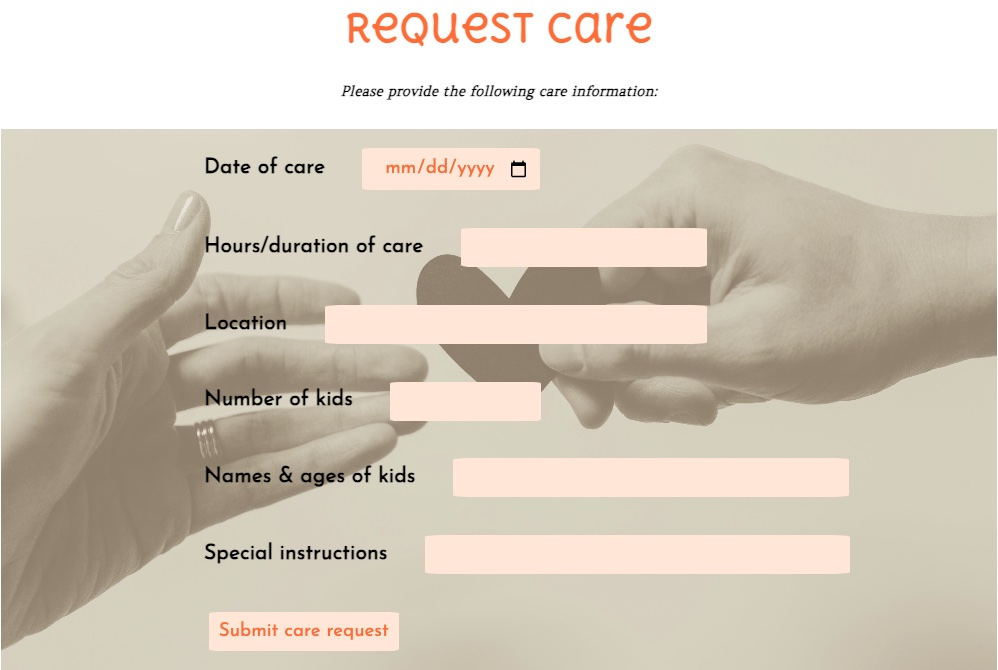

<!-- PROJECT LOGO -->
 

<h2 align="center">
    <a href="https://vibrant-village-6e72f0c47e7c.herokuapp.com/" target="_blank" rel="noopener noreferrer" >Vibrant Village</a>
</h2>

  

    Vibrant Village is a platform that creates community care in your neighborhood. Users can input details of needed child care services, and other users can fulfill their care requests, all for free!
  

<!-- TABLE OF CONTENTS -->

  
Table of Contents

  <ol>
    <li>
      <a href="#about-the-project">About The Project</a>
      <ul>
        <li><a href="#game-images">App Images</a></li>
        <li><a href="#built-with">Built With</a></li>
      </ul>
    </li>
    <li><a href="#getting-started">Getting Started</a></li>
    <li><a href="#next-steps">Next Steps</li>
  </ol>

## About The Project

Raising the next generation doesn't have to take the life out of you. Most modern caregivers don't have access to the village support system of generations past. We created Vibrant Village so that your family can grow and thrive while surrounded by a customizable community of support.

(<a href="#readme-top">back to top</a>)

## Game Images

(<a href="#readme-top">back to top</a>)

## Built With

* HTML
* CSS
* Javascript
* Node.js
* Express.js
* MongoDB / Mongoose

(<a href="#readme-top">back to top</a>)

## Getting Started

<h4>How to Use Vibrant Village:</h4>
<h5>Click <a href="https://vibrant-village-6e72f0c47e7c.herokuapp.com/" target="_blank" rel="noopener noreferrer" >here</a> to visit the site!</h5>
<ol>
    <li>Log in using your Google account</li>
    <li>If you are looking to request child care, click the "Request care" button on the home page. Fill out your child care request details, and submit! Delete any care requests you no longer need.</li>
    <li>If you are looking to fulfill another user's child care request, click the "Provide care" button the home page. Review the schedule of care needs to find a date, time, and location that works with your availability, and sign up to provide care. Commitments to provide care can be deleted if you become unavailable.</li>
</ol>

(<a href="#readme-top">back to top</a>)

## Next Steps

<h4>In future versions, we hope to roll out the following features:</h4>
<ul>
    <li>Users can edit previously submitted care requests.</li>
    <li>Users can create a customized profile of children, preferred care locations, and child care experience and preferences.</li>
    <li>Users can filter care requests by date and time to more easily find a care request that matches their availability.</li>
    <li>Users can receive notifications for care requests when another user signs up to provide care for that request.</li>
    <li>Users can view their calendar of care submissions and/or days they have agreed to provide care for another user.</li>
    <li>Users can create personalized communities and invite other users to be part of their care community based on location, availability, parenting preferences, and familiarity.</li>
</ul>

(<a href="#readme-top">back to top</a>)
